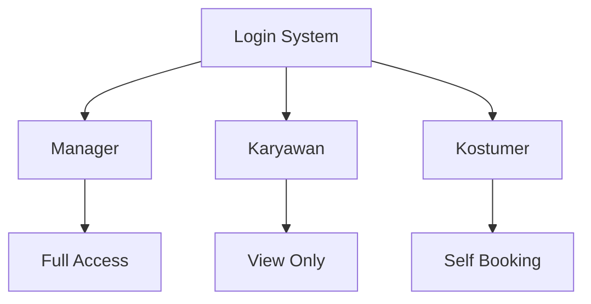
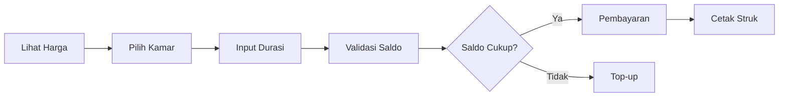

# 🚀 DDP-UAS-SMSTR-1
# Anggota Kelompok 7 DDP
1. Brendhen Canafaro Lie
2. Ahmad Afif Al Ghifary
3. Rivalio Chendra
# 🏨 Sistem Reservasi Hotel

<div align="center">


**Sistem manajemen reservasi hotel berbasis CLI yang powerful dan user-friendly**

[Fitur](#-fitur-utama) • [Instalasi](#-instalasi) • [Penggunaan](#-cara-menjalankan) • [Dokumentasi](#-panduan-penggunaan)

</div>

---

## 📋 Daftar Isi

- [Tentang Proyek](#-tentang-proyek)
- [Fitur Utama](#-fitur-utama)
- [Persyaratan Sistem](#-persyaratan-sistem)
- [Instalasi](#-instalasi)
- [Struktur Data](#-struktur-data)
- [Cara Menjalankan](#-cara-menjalankan)
- [Panduan Penggunaan](#-panduan-penggunaan)
- [Sistem Harga](#-sistem-harga)
- [Contoh Penggunaan](#-contoh-penggunaan)
- [Fitur Keamanan](#-fitur-keamanan)
- [Troubleshooting](#-troubleshooting)
- [Kontribusi](#-kontribusi)

---

## 🎯 Tentang Proyek

Sistem Reservasi Hotel adalah aplikasi berbasis Python yang dibangun untuk mengelola pemesanan kamar hotel dengan efisien. Aplikasi ini menyediakan interface CLI yang intuitif dengan tiga level akses pengguna yang berbeda.

### 🌟 Mengapa Menggunakan Sistem Ini?

- ✅ **Multi-Role Access** - Sistem role-based untuk Manager, Karyawan, dan Kostumer
- ✅ **E-Wallet Terintegrasi** - Pembayaran digital yang aman dan cepat
- ✅ **Real-time Updates** - Status kamar terupdate otomatis
- ✅ **Security First** - Password protection dan rate limiting
- ✅ **User Friendly** - Interface yang mudah dipahami

---

## 🚀 Fitur Utama

### 👔 Manajemen Multi-Role



| Role | Akses | Fitur Utama |
|------|-------|-------------|
| 👨‍💼 **Manager** | Full Control | ✏️ CRUD Reservasi, 📊 Monitoring, 🔧 Manajemen Kamar |
| 👷 **Karyawan** | Read Only | 👀 View Reservasi, 📋 Cek Status Kamar |
| 👤 **Kostumer** | Self-Service | 🛏️ Booking Kamar, 💰 E-Money Management, 🎫 VIP Benefits |

### 💳 Sistem Pembayaran Digital


- 💰 E-Money terintegrasi untuk transaksi
- 🎁 Diskon khusus **15%** untuk akun VIP
- 📈 Top-up saldo dengan validasi (Rp 50.000 - Rp 1.000.000)
- 🧾 Struk digital otomatis

### 🔐 Keamanan


- 🔒 Password tersembunyi menggunakan `pwinput`
- ⏱️ Rate limiting dengan penalti waktu (30/60/90 detik)
- 🚫 Maksimal 10 percobaan login
- 🛡️ Exception handling komprehensif

---

## 💻 Persyaratan Sistem

### 🐍 Python Version


```bash
python --version
# Output: Python 3.7.0 atau lebih tinggi
```

### 📦 Dependencies

| Library | Version | Fungsi |
|---------|---------|--------|
| `prettytable` | 3.0.0+ | 📊 Tampilan tabel data |
| `pwinput` | 1.0.3+ | 🔐 Input password aman |
| `json` | built-in | 📄 Data persistence |
| `os` | built-in | 🖥️ Operasi sistem |
| `datetime` | built-in | 📅 Manajemen tanggal |

---

## 📥 Instalasi

### Step 1: Clone Repository

```bash
git clone <repository-url>
cd hotel-reservation-system
```

### Step 2: Install Dependencies

```bash
pip install prettytable pwinput
```

**Atau menggunakan requirements.txt:**

```bash
pip install -r requirements.txt
```

### Step 3: Setup File JSON

Pastikan file-file berikut ada di direktori yang sama:

```
📁 hotel-reservation-system/
├── 📄 main.py
├── 📋 DataReservasi.json
├── 📋 DataCheckList.json
├── 📋 DataHarga.json
├── 📋 DataKaryawan.json
├── 📋 DataManager.json
└── 📋 DataKostumer.json
```

---

## 📊 Struktur Data

### 🏨 DataReservasi.json

```json
[
  {
    "No": 1,
    "Nama Tamu": "John Doe",
    "Nomor Kamar": 5,
    "Durasi": 3,
    "Total Harga": 900000
  }
]
```

**Field Description:**
- `No` - ID unik reservasi (auto-increment)
- `Nama Tamu` - Nama lengkap tamu
- `Nomor Kamar` - Nomor kamar (1-10)
- `Durasi` - Lama menginap dalam hari
- `Total Harga` - Total biaya dalam Rupiah

### ✅ DataCheckList.json

```json
[
  {
    "Kamar": 1,
    "Status": "Tersedia"
  },
  {
    "Kamar": 2,
    "Status": "Ditempati"
  }
]
```

**Status Options:**
- `Tersedia` - Kamar siap dipesan
- `Ditempati` - Kamar sedang digunakan

### 👤 DataKostumer.json

```json
[
  {
    "Username": "customer1",
    "Password": "pass123",
    "E-Money": 500000,
    "Tipe": "VIP"
  }
]
```

**Tipe Akun:**
- 🌟 `VIP` - Diskon 15%, akses prioritas
- 📝 `Reguler` - Akses standar

---

## ▶️ Cara Menjalankan

### Menjalankan Aplikasi

```bash
python main.py
```

### 🔑 Flow Login

```
┌─────────────────────────────────┐
│     Login Sistem                │
├─────────────────────────────────┤
│  1. Manager                     │
│  2. Karyawan                    │
│  3. Kostumer                    │
│  4. Buat Akun                   │
│  5. Keluar                      │
└─────────────────────────────────┘
```

**Langkah-langkah:**

1. 📝 Pilih role yang sesuai (1-3)
2. 🔐 Masukkan username dan password
3. ✅ Akses menu sesuai role
4. 🆕 Atau pilih "Buat Akun" untuk registrasi

---

## 📖 Panduan Penggunaan

### 👨‍💼 Untuk Manager

Manager memiliki akses penuh ke sistem dengan menu lengkap:

```
┌─────────────────────────────────┐
│  Sistem Reservasi Hotel         │
├─────────────────────────────────┤
│  1. ➕ Tambah Reservasi          │
│  2. 👁️ Lihat Reservasi           │
│  3. ✏️ Ubah Reservasi            │
│  4. 🗑️ Hapus Reservasi           │
│  5. 📋 Lihat Ketersediaan Kamar │
│  6. 🚪 Kembali Halaman Login    │
└─────────────────────────────────┘
```

#### ➕ Tambah Reservasi

**Alur Proses:**

```
Input Nama Tamu → Pilih Kamar → Tentukan Durasi → Kalkulasi Otomatis → Konfirmasi
```

**Contoh Input:**

```
Nama Tamu: Budi Santoso
Kamar tersedia: [1, 3, 5, 7, 9]
Nomor Kamar: 7
Durasi (hari): 2
```

**Output:**

```
✅ Reservasi berhasil! Total: Rp 1,200,000
```

#### 👁️ Lihat Reservasi

**Tampilan Tabel:**

```
+----+---------------+--------------+---------------+--------------+
| No | Nama Tamu     | Nomor Kamar  | Durasi (hari) | Total Harga  |
+----+---------------+--------------+---------------+--------------+
| 1  | Budi Santoso  | 7            | 2             | Rp 1,200,000 |
| 2  | Ani Lestari   | 3            | 4             | Rp 1,200,000 |
+----+---------------+--------------+---------------+--------------+
```

#### ✏️ Ubah Reservasi

**Fitur Update:**
- 📝 Ubah nama tamu
- 🔄 Pindah kamar (otomatis update status)
- 📅 Ubah durasi menginap
- 💰 Recalculate harga otomatis

#### 🗑️ Hapus Reservasi

**Proses:**
1. Pilih nomor reservasi
2. Konfirmasi penghapusan
3. Kamar otomatis menjadi "Tersedia"
4. Re-index nomor reservasi

---

### 👷 Untuk Karyawan

Akses view-only untuk monitoring:

```
┌─────────────────────────────────┐
│  Menu Karyawan                  │
├─────────────────────────────────┤
│  1. 👁️ Lihat Reservasi           │
│  2. 📋 Lihat Ketersediaan Kamar │
│  3. 🚪 Kembali Halaman Login    │
└─────────────────────────────────┘
```

**Kegunaan:**
- 📊 Monitoring reservasi aktif
- 🏨 Cek status kamar real-time
- 📞 Informasi untuk tamu yang inquiry

---

### 👤 Untuk Kostumer

Menu self-service untuk tamu hotel:

```
┌─────────────────────────────────┐
│  Menu Kostumer                  │
├─────────────────────────────────┤
│  1. 🛏️ Pesan Kamar               │
│  2. 💰 Tambah Saldo E-Money     │
│  3. 👁️ Lihat Saldo E-Money       │
│  4. 🚪 Kembali Halaman Login    │
└─────────────────────────────────┘
```

#### 🛏️ Pesan Kamar

**Flow Pemesanan:**



**Contoh Pemesanan:**

```bash
# Step 1: Lihat harga dan ketersediaan
Kamar tersedia: [1, 2, 4, 6, 8, 10]

# Step 2: Input data
Nama Anda: Ahmad Rahman
Pilih Kamar: 6
Durasi (hari): 3

# Step 3: Konfirmasi
Harga per malam: Rp 600,000
Total: Rp 1,800,000
Saldo Anda: Rp 2,000,000

# Step 4: Pembayaran
✅ Pemesanan berhasil!
Saldo tersisa: Rp 200,000
```

#### 💰 Manajemen E-Money

**Top-up Saldo:**

```bash
Masukkan jumlah saldo: 100000
✅ Saldo berhasil ditambahkan!
Saldo Anda sekarang: Rp 600,000
```

**Validasi:**
- 💵 Minimum: Rp 50,000
- 💰 Maximum: Rp 1,000,000
- ⚠️ Error handling untuk input invalid

#### 🧾 Struk Digital

**Format Struk:**

```
====================================================
=                Pembelian Kamar                   =
====================================================
    Nama            : Ahmad Rahman
    Tanggal         : 2025-10-26
    Lantai Kamar    : 2
    Harga Per Malam : Rp 600,000
    Durasi          : 3 Hari
====================================================
=   Total            : Rp 1,800,000
====================================================
= Terima Kasih atas Kunjungan Anda!                =
= Silakan Simpan Struk Ini sebagai Bukti.          =
====================================================
```

---

## 💵 Sistem Harga

### 📊 Tabel Harga Kamar

| Kamar | Lantai | Harga per Malam | Kategori |
|-------|--------|-----------------|----------|
| 🛏️ 1-5 | 1️⃣ Lantai 1 | 💰 Rp 300,000 | Standard |
| 🛏️ 6-10 | 2️⃣ Lantai 2 | 💎 Rp 600,000 | Premium |

### 🎁 Sistem Diskon

**Akun VIP:**
- 🌟 Diskon otomatis 15%
- 🎯 Berlaku untuk semua pemesanan
- 💳 Potongan langsung saat pembayaran

**Contoh Perhitungan:**

```python
# Akun Reguler
Kamar: 8 (Lantai 2)
Durasi: 2 hari
Harga: 2 × Rp 600,000 = Rp 1,200,000
Total: Rp 1,200,000

# Akun VIP
Kamar: 8 (Lantai 2)
Durasi: 2 hari
Harga: 2 × Rp 600,000 = Rp 1,200,000
Diskon: 15% = Rp 180,000
Total: Rp 1,020,000 ✨
```

---

## 💡 Contoh Penggunaan

### 📝 Scenario 1: Manager Membuat Reservasi

```python
# Login sebagai Manager
Username: manager1
Password: ****

# Menu Manager → Pilih 1 (Tambah Reservasi)
====================================================
Kamar tersedia: [1, 3, 5, 7, 9]
====================================================

Nama Tamu: Siti Nurhaliza
Nomor Kamar: 5
Durasi: 4

====================================================
✅ Reservasi berhasil! Total: Rp 1,200,000
====================================================
```

### 🛏️ Scenario 2: Kostumer VIP Booking Kamar

```python
# Login sebagai Kostumer VIP
Username: vipuser1
Password: ****

# Menu Kostumer → Pilih 1 (Pesan Kamar)
====================================================
Daftar Harga Kamar
====================================================
Kamar 6 - Lantai 2 - Rp 600,000/malam

Nama Anda: Rahmat Hidayat
Pilih Kamar: 6
Durasi: 5 hari

====================================================
Harga normal: Rp 3,000,000
🎁 Diskon VIP (15%): Rp 450,000
Total bayar: Rp 2,550,000
====================================================

Saldo Anda: Rp 3,000,000
✅ Pemesanan berhasil!
Saldo tersisa: Rp 450,000
```

### 💰 Scenario 3: Top-up E-Money

```python
# Menu Kostumer → Pilih 2 (Tambah Saldo)
====================================================
Saldo saat ini: Rp 450,000

Masukkan jumlah saldo: 500000

✅ Saldo berhasil ditambahkan!
Saldo Anda sekarang: Rp 950,000
====================================================
```

### 📊 Scenario 4: Karyawan Cek Status

```python
# Login sebagai Karyawan
Username: staff1
Password: ****

# Menu Karyawan → Pilih 2 (Lihat Ketersediaan)
====================================================
Status Kamar
====================================================
+-------+------------+
| Kamar | Status     |
+-------+------------+
| 1     | Tersedia   |
| 2     | Ditempati  |
| 3     | Tersedia   |
| 4     | Tersedia   |
| 5     | Ditempati  |
| 6     | Ditempati  |
| 7     | Tersedia   |
| 8     | Tersedia   |
| 9     | Tersedia   |
| 10    | Tersedia   |
+-------+------------+
```

---

## 🔐 Fitur Keamanan

### 🔒 Password Protection


```python
# Input password tersembunyi menggunakan pwinput
Password: ******* (tidak terlihat saat mengetik)
```

**Keamanan:**
- ✅ Input tidak terlihat di layar
- ✅ Tidak tersimpan di command history
- ✅ Lowercase normalization

### ⏱️ Rate Limiting System

**Penalti Progresif:**

```
Percobaan 1-2:   ✅ Langsung retry
Percobaan 3:     ⏰ Tunggu 30 detik
Percobaan 6:     ⏰ Tunggu 60 detik
Percobaan 9:     ⏰ Tunggu 90 detik
Percobaan 10:    🚫 Akun dikunci (keluar otomatis)
```

**Visualisasi:**

```
Login Attempt: ███░░░░░░░ (3/10)
Status: ⏰ Tunggu 30 detik...
```

### 🛡️ Exception Handling

**Jenis Error yang Ditangani:**

| Error Type | Handling | User Message |
|------------|----------|--------------|
| `FileNotFoundError` | ✅ Auto-create | "Membuat file kosong..." |
| `JSONDecodeError` | ✅ Return empty | "Error membaca JSON" |
| `ValueError` | ✅ Re-prompt | "Input harus angka!" |
| `KeyboardInterrupt` | ✅ Graceful exit | "Proses dibatalkan" |
| `Exception` | ✅ Log & inform | "Error tak terduga" |

---

## 🔧 Troubleshooting

### ❌ Problem: File JSON Tidak Ditemukan

**Symptoms:**
```
FileNotFoundError: [Errno 2] No such file or directory: 'DataReservasi.json'
```

**Solution:**
```python
# Aplikasi otomatis membuat file kosong
# Atau buat manual dengan:
echo '[]' > DataReservasi.json
echo '[]' > DataCheckList.json
echo '[]' > DataHarga.json
```

### ❌ Problem: Error Input Type

**Symptoms:**
```
ValueError: invalid literal for int()
```

**Solution:**
- ✅ Pastikan input angka untuk pilihan menu
- ✅ Gunakan angka untuk nomor kamar
- ✅ Input durasi harus integer positif

### ❌ Problem: Kamar Penuh

**Symptoms:**
```
❌ Maaf, semua kamar penuh (maksimal 10)
```

**Solution:**
```python
# Login sebagai Manager
# Hapus reservasi yang sudah check-out
Menu → 4 (Hapus Reservasi)
# Pilih nomor reservasi untuk dihapus
```

### ❌ Problem: Saldo Tidak Cukup

**Symptoms:**
```
❌ Uang Tidak Cukup
```

**Solution:**
```python
# Top-up saldo
Menu Kostumer → 2 (Tambah Saldo)
# Minimum Rp 50,000
```

### ❌ Problem: Permission Denied

**Symptoms:**
```
PermissionError: [Errno 13] Permission denied
```

**Solution:**
```bash
# Pastikan file tidak read-only
chmod 644 *.json

# Atau jalankan dengan permission yang sesuai
sudo python main.py  # Linux/Mac
# Run as Administrator (Windows)
```

---

## 🤝 Kontribusi

### 🎯 Development Focus

Sistem ini dibangun dengan prinsip:

```
✨ Clean Code
├── 📝 Komentar lengkap bahasa Indonesia
├── 🧩 Separation of concerns (data, logic, UI)
├── 👥 User-friendly interface
└── 🛡️ Robust error handling
```

### 🚀 Roadmap Pengembangan

**Phase 1: Foundation** ✅
- [x] Multi-role authentication
- [x] CRUD reservasi
- [x] E-wallet integration
- [x] VIP system

**Phase 2: Enhancement** 🔄
- [ ] 🗄️ Database integration (MySQL/PostgreSQL)
- [ ] 🖼️ GUI menggunakan Tkinter/PyQt
- [ ] 📊 Advanced reporting & analytics
- [ ] 📧 Email notification system

**Phase 3: Advanced** 📋
- [ ] 🌐 REST API development
- [ ] 📱 Mobile app integration
- [ ] 💳 Payment gateway (Midtrans, etc)
- [ ] 📄 PDF report generation
- [ ] 🔔 Real-time notifications

### 🐛 Bug Reports

Temukan bug? Laporkan dengan format:

```markdown
**Deskripsi Bug:**
[Jelaskan masalahnya]

**Langkah Reproduksi:**
1. Langkah pertama
2. Langkah kedua
3. ...

**Expected vs Actual:**
- Expected: [Apa yang seharusnya terjadi]
- Actual: [Apa yang terjadi]

**Environment:**
- OS: [Windows/Linux/Mac]
- Python: [versi]
- Dependencies: [versi library]
```

### 💻 Pull Requests

Kontribusi code? Follow guidelines:

1. 🔱 Fork repository
2. 🌿 Create feature branch (`git checkout -b feature/AmazingFeature`)
3. 💾 Commit changes (`git commit -m 'Add some AmazingFeature'`)
4. 📤 Push to branch (`git push origin feature/AmazingFeature`)
5. 🔃 Open Pull Request

**Code Style:**
- 🐍 Follow PEP 8
- 📝 Komentar dalam Bahasa Indonesia
- 🧪 Include unit tests
- 📚 Update documentation

---

## 📄 Lisensi


Proyek ini dilisensikan under MIT License - lihat file [LICENSE](LICENSE) untuk detail.

**Anda bebas untuk:**
- ✅ Menggunakan untuk keperluan komersial
- ✅ Memodifikasi source code
- ✅ Mendistribusikan
- ✅ Penggunaan pribadi

**Dengan syarat:**
- 📝 Include copyright notice
- 📋 Include license text

---

## 📞 Kontak & Support

<div align="center">

[](https://github.com/yourusername/hotel-reservation)
[](mailto:support@hotelreservation.com)
[](https://docs.hotelreservation.com)

</div>

---

## ⚠️ Catatan Penting

> **⚡ Development Environment**  
> Sistem ini dirancang untuk environment development dan pembelajaran.  
> Untuk production deployment, pertimbangkan:
> - 🔐 Enhanced security measures
> - 🗄️ Database implementation
> - 🔄 Load balancing
> - 📊 Logging & monitoring
> - 🔙 Backup & recovery system

> **💾 Data Backup**  
> Selalu backup file JSON secara berkala untuk menghindari kehilangan data.  
> Rekomendasi: Setup automated backup setiap hari.

---

<div align="center">

**⭐ Star this repository jika bermanfaat! ⭐**

Made with ❤️ by Hotel Reservation Team


</div>
