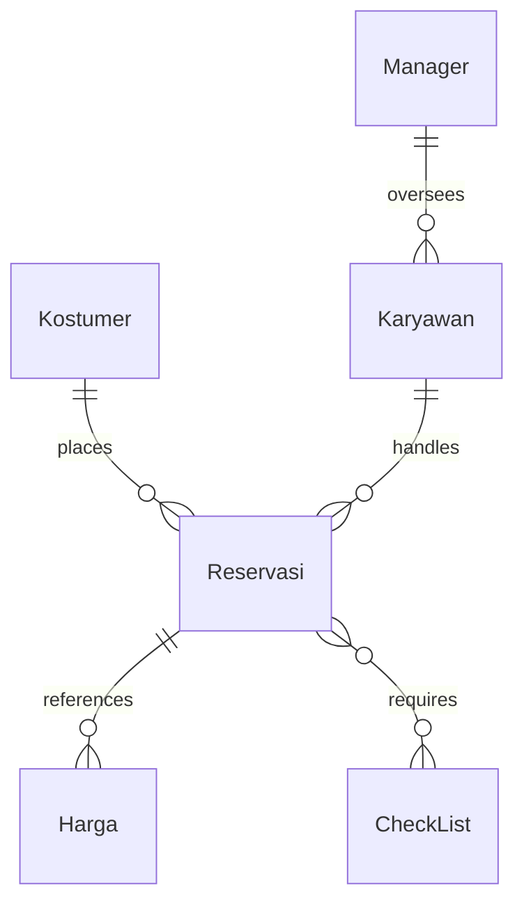

# 🚀 DDP-UAS-SMSTR-1

## Short Description
Welcome to **DDP-UAS-SMSTR-1**, a robust and intuitive Hotel Reservation and Management System crafted in Python. This project elegantly demonstrates fundamental programming concepts by simulating the core operations of a hotel, including managing reservations, customer details, employee records, pricing structures, and operational checklists. Designed as a comprehensive final project for "Dasar-Dasar Pemrograman" (Fundamentals of Programming) in its inaugural semester, it's a testament to structured design and practical application.

## 🛡️ Project Health & Status
This project is functional, stable, and represents a **complete solution for a university assignment**. It provides a foundational, yet comprehensive, standalone application for basic hotel management tasks. While not built for enterprise-scale deployment, it serves as an excellent educational and operational tool for understanding system logic and data handling.

## ✨ Key Features
*   **Comprehensive Reservation Management:** Effortlessly create, view, and manage hotel reservations.
*   **Dynamic Pricing System:** Handle varying room rates and service charges with a dedicated pricing data structure.
*   **Customer Relationship Management (CRM):** Maintain detailed records of all hotel guests and their preferences.
*   **Employee Administration:** Keep track of staff information and roles within the hotel system.
*   **Managerial Oversight:** Access specialized data for administrative and oversight functions.
*   **Operational Checklists:** Manage internal tasks and ensure smooth hotel operations (e.g., room readiness).
*   **JSON-Based Data Storage:** Simple, human-readable data persistence for all system information.

## Who is this for?
*   **Hospitality Students:** Gain hands-on experience with the logic behind hotel operations.
*   **Small Hotel Owners/Managers:** A basic, easily adaptable system for managing day-to-day tasks.
*   **Python Beginners:** Learn practical application development, file I/O, and data structure manipulation.
*   **Educators:** An excellent example project for teaching programming fundamentals and system design.

## Technology Stack & Architecture
This system is built upon a lean and efficient stack, prioritizing clarity and direct execution:
*   **Core Language:** Python
*   **Data Storage:** JSON (for all persistent data records)

The architecture is that of a standalone application, with the `ReservasiHotel.py` script acting as the central processing unit, reading from and writing to local JSON files for all data persistence.

## 📊 Architecture & Database Schema
The project's data model is structured across several key JSON files, forming the backbone of the hotel management system. This simplified Entity-Relationship Diagram illustrates the high-level connections:



## ⚙️ Configuration & Deployment
This project is designed for simplicity. No complex configurations or external services are required beyond a Python environment.

1.  **Python Environment:** Ensure you have Python 3.x installed on your system.
2.  **Data Files:** The project relies on the accompanying `.json` files for data storage. These files will be created or updated directly by the Python script.

## ⚡ Quick Start Guide
Get the hotel management system up and running in a few simple steps:

1.  **Clone the Repository:**
    ```bash
    git clone https://github.com/BrendhenCanafaroLie/DDP-UAS-SMSTR-1.git
    cd DDP-UAS-SMSTR-1
    ```
2.  **Run the Application:**
    ```bash
    python ReservasiHotel.py
    ```
    The application will launch, presenting you with an interactive command-line interface to manage hotel operations.